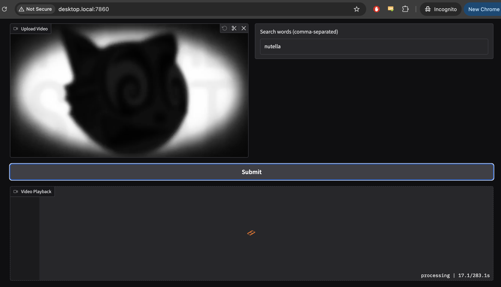
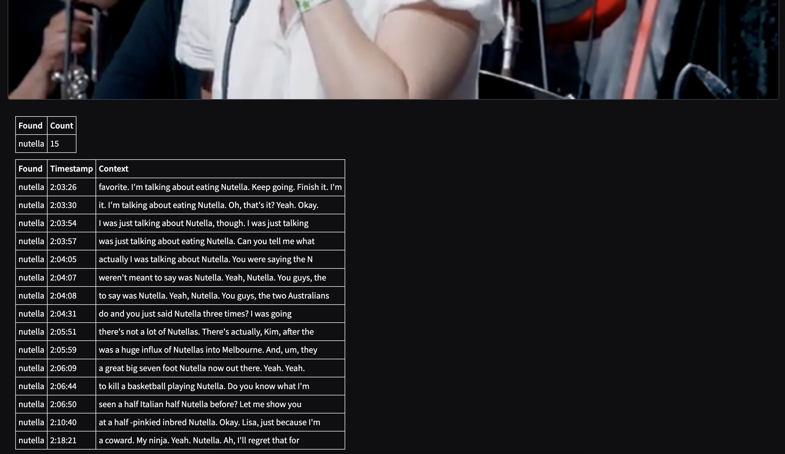

<h1 style="text-align: center;">Tony's Stick Bundle Finder</h1>

<div style="text-align: center;">
  
  
</div>

## 📌 Overview

Tony Hinchcliffe [hires two people](https://youtu.be/SGECF7cIeFo?t=3461) to count the number of occurrences of a 
certain word mentioned in Kill Tony, so they can censor it to avoid demonetization.

This tool uses a locally run AI transcription model to do this automatically.

## ✨ Features
- Locally run web app to load the relevant video, enter words/phrases of interest, and submit for processing.



- Produces a summary with timestamps and context of all instances of that word identified. Clicking a row will jump to 
    that portion of the video for manual review.



- Runs entirely locally, so there is no concern about the video being leaked, or requirement to trust a third-party 
    provider. 
- Takes less than 5 minutes to transcribe and search a 2hr 20min video on my power-limited Nvidia RTX 3090

## 🚨 Requirements
- Nvidia GPU with at least 6GB of vRAM.
- Either Windows or Linux (can run on a windows/linux machine and access the web app from a MacOS computer connected to
    the same local network if required).
- Anybody with a low-mid tier gaming PC can run this.

## 🚀 Quick Start - Docker Desktop

ℹ️ Note: I have detailed two methods below, using either the UI or command line

**UI Method** below uses the docker desktop user interface.

**CLI Method** below uses the command line (EG: Command Prompt, Powershell) **This is recommended** and will be necessary to use the GPU for much faster 
    transcription.

### 1. Install Docker Desktop
- **Download**: [docker.com/products/docker-desktop](https://www.docker.com/products/docker-desktop/)
- **Install**: Double-click the downloaded file and follow installation prompts
- **Open**: Open Docker Desktop

### 2. Get this Container
**UI Method**:
1. Open Docker Desktop
2. Go to **Images** tab
3. Search `tonysstickbundlefinder/transcribe-and-search` in search bar
4. Click **Pull** and select `v0.1.0` tag

**CLI Method**:  
```bash
docker pull tonysstickbundlefinder/transcribe-and-search:v0.1.0
```

### 3. Run the Container
**UI Method**:

⚠️ WARNING: The UI method below does not allow the container to use your GPU. Unfortunately there is no option to use GPU 
passthrough via the user interface. It's recommended that you use the command line interface below instead.

1. In **Images** tab, find the pulled image
2. Click **Run**
3. Under **Optional settings**:
   - Ports: `7860:7860`
4. Click **Run**

**CLI Method**:  
```bash
docker run --gpus all -p 7860:7860 --rm tonysstickbundlefinder/transcribe-and-search:v0.1.0
```

ℹ️ Note: If you run into errors running this, it's possible you need to separately install the 
[nvidia container toolkit](https://docs.nvidia.com/datacenter/cloud-native/container-toolkit/latest/install-guide.html). 
If you are not tech savvy, just keep pasting the error messages into ChatGPT and it will be
able to guide you through everything.

### 4. Use the Web Interface
1. Open your browser to: [http://localhost:7860](http://localhost:7860)
2. Upload your video file
3. Enter search terms (comma-separated)
4. Click **Submit**
5. Wait for processing to complete
6. View results

## 🛠️ Methodology

- Audio is extracted from the uploaded video.
- Extracted audio is run through the [openai/whisper-large-v3-turbo](https://huggingface.co/openai/whisper-large-v3-turbo) 
    model to produce a complete transcript with timestamps.
- That transcript is then searched for each word/phrase entered (and variants of those words)
    to identify when they occur.

## 📄 License
This project is licensed under the **MIT License**.
